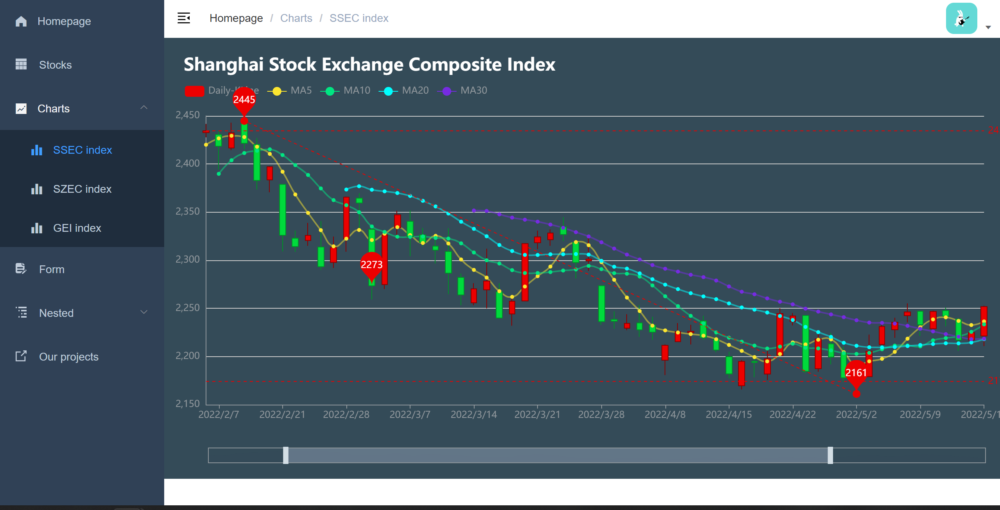
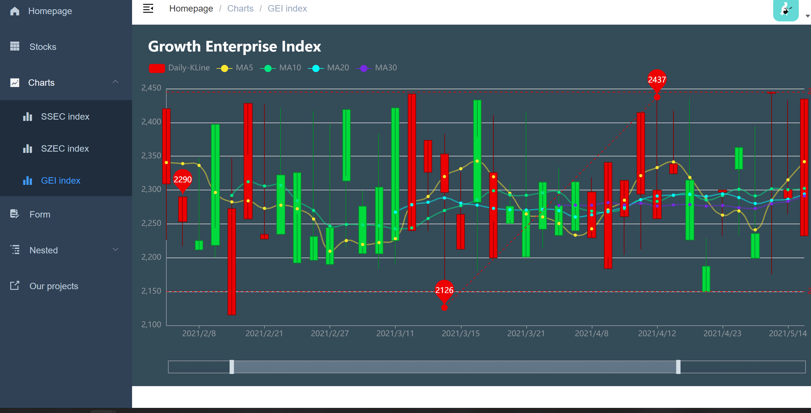
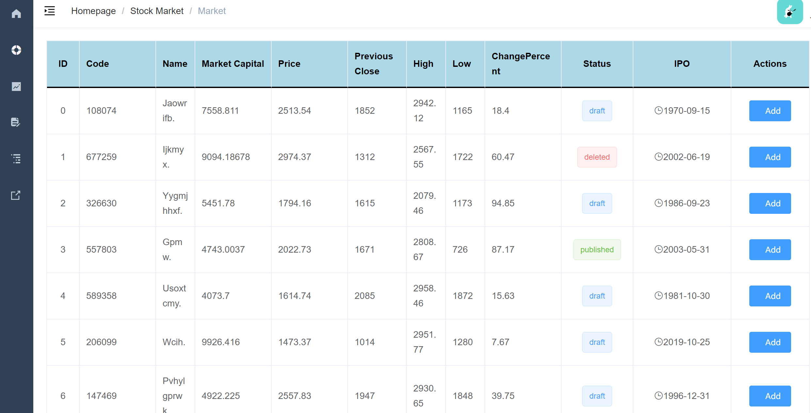
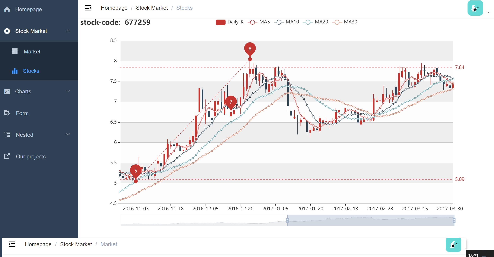
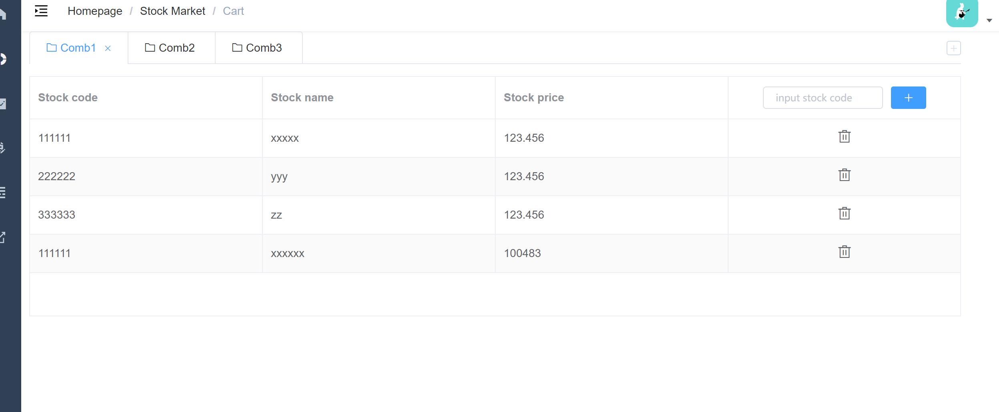

### vue-element-admin-template

登陆注册 密码不限
股票作图TODO

## 2022/3/11

完成 股票作图 分别是上证指数，深证指数和创业板指数

数据是自己模拟的

## 2022/3/12

加入stockmarket的table

点击可查看每一个股票的详细参数：

选股部分TODO

表单部分TODO

## 22/3/16

完成选股combo用户可以自定义添加自己的组合或者删除组合。通过输入code方式为相应组合增加code

 
